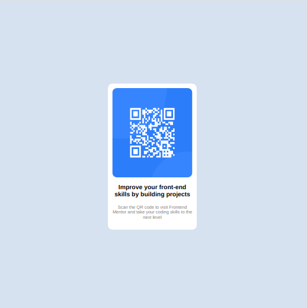

# Frontend Mentor - Product preview card component solution

This is a solution to the [Product preview card component challenge on Frontend Mentor](https://www.frontendmentor.io/challenges/qr-code-component-iux_sIO_H). Frontend Mentor challenges help you improve your coding skills by building realistic projects.

## Table of contents

-   [Overview](#overview)
    -   [The challenge](#the-challenge)
    -   [Screenshot](#screenshot)
    -   [Links](#links)
-   [My process](#my-process)
    -   [Built with](#built-with)
    -   [What I learned](#what-i-learned)
    -   [Continued development](#continued-development)
    -   [Useful resources](#useful-resources)
-   [Author](#author)

## Overview

### The challenge

### Screenshot

## In this section i include two screenshots, one for the mobile version and another for the computer

. .

### Links

-   Live Site URL: [my site]()

<!-- need url -->

## My process

This project is very similar to one I had done before (https://github.com/josuemrodrig/card-component), but unlike the previous one here I tried not to use so many containers to store my elements (h1, p, img) and I made use of the flex grow property to provide the space suitable between them, although I understand that I could use the margin button for that, I also decided to do it that way to gradually learn other ways to reach the same result or at least a similar one

### Built with

-   Semantic HTML5 markup
-   CSS custom properties
-   Flexbox

### Continued development

At this point I am trying to use what I have learned about html and css, at the same time I am learning javascript concepts, I hope in the future to start doing small projects using this language.

## Author

-   Frontend Mentor - [@josuemrodrig](https://www.frontendmentor.io/profile/josuemrodrig)
